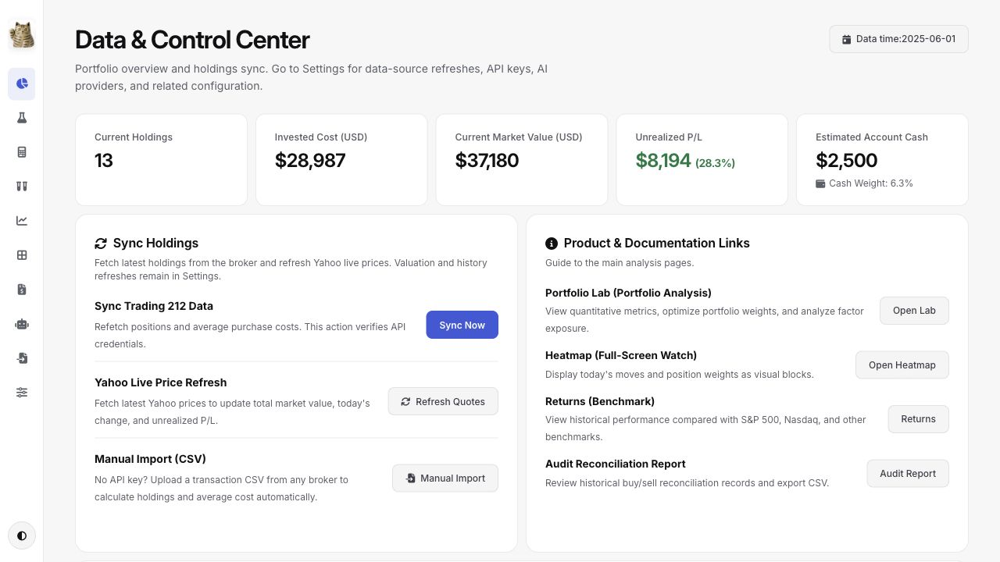
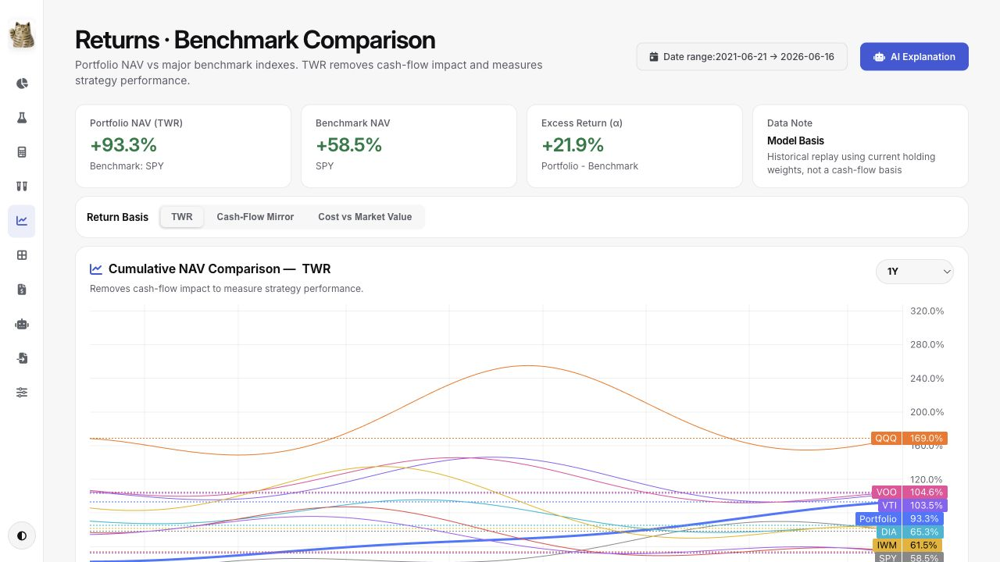
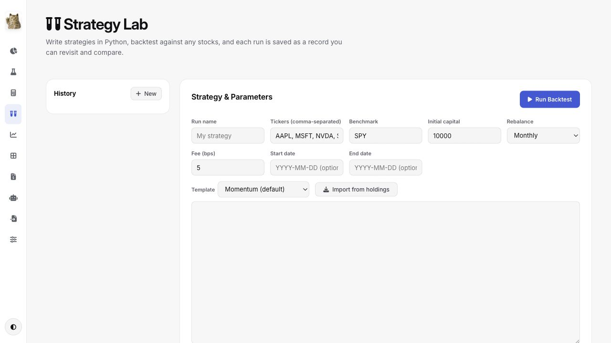
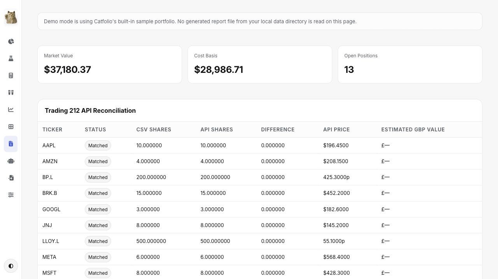

# Catfolio — Local-first Portfolio, Quant, and Strategy Dashboard

Catfolio is a self-hosted portfolio dashboard and quantitative research workspace for investors who want a private command center for holdings, returns, risk, strategy experiments, and AI-assisted analysis.

It runs locally as a web app, can be packaged as a macOS desktop app, and ships with a full demo mode so contributors can explore the product without a broker account or API keys.

The project combines portfolio accounting with quant-style research tools: factor exposure, benchmark comparison, Monte Carlo simulation, efficient-frontier optimization, historical return modeling, and saved Python strategy backtests.

Project repository: [github.com/irrwood/catfolio](https://github.com/irrwood/catfolio)

## Highlights

- **Local-first by default**: portfolio files, imported CSVs, caches, saved strategy runs, and API keys stay on your machine.
- **Demo-safe for open source**: `CATFOLIO_DEMO=1` uses bundled sample data and does not read local private reports.
- **Broker sync or CSV import**: connect Trading 212 for live holdings, or upload broker transaction CSVs to calculate weighted-average cost and current positions.
- **Portfolio dashboard**: total value, cash, P&L, concentration, sector exposure, data freshness, and alert previews.
- **Portfolio Lab**: quantitative portfolio analysis with drawdowns, volatility, Sharpe ratio, factor exposure, correlation, Monte Carlo simulation, efficient frontier, and current-weight historical backtests.
- **Returns workspace**: portfolio returns against benchmarks such as SPY, QQQ, and IWM, with monthly heatmaps.
- **Strategy Lab**: write Python allocation strategies, rebalance over historical prices, compare CAGR/volatility/Sharpe/max drawdown, save runs, and optionally ask an AI provider to critique the result.
- **AI analysis**: portfolio briefing, risk diagnosis, performance explanation, overlap analysis, what-if scenarios, returns explanation, and free-form portfolio Q&A.
- **Provider choices**: DeepSeek, Grok/xAI, OpenAI, Gemini, Moonshot Kimi, Zhipu GLM, Qwen, and OpenRouter are supported through one provider registry.
- **Desktop build**: PyInstaller + pywebview packaging for `Catfolio.app` on macOS.

## Screenshots

These screenshots use Catfolio's built-in demo data mode. No real portfolio data, broker account, or API key is shown.

| Dashboard | Returns & Benchmarks |
| --- | --- |
|  |  |

| Strategy Lab | Audit Report |
| --- | --- |
|  |  |

## Quick Start

### Docker

```bash
git clone https://github.com/irrwood/catfolio.git
cd catfolio
docker compose up
```

Open [http://localhost:8787](http://localhost:8787). Docker runs in demo mode by default.

### Python

```bash
git clone https://github.com/irrwood/catfolio.git
cd catfolio/v3_backend

python -m venv .venv
source .venv/bin/activate
pip install -r requirements.txt

CATFOLIO_DEMO=1 uvicorn app.main:app --host 127.0.0.1 --port 8787
```

Open [http://localhost:8787](http://localhost:8787).

The first visit to Returns or Portfolio Lab may take longer while Yahoo Finance history is fetched and cached.

## Live Data Setup

Copy the example environment file and fill in only the integrations you want to use:

```bash
cp .env.example .env
```

Common variables:

```env
# Trading 212 portfolio sync
TRADING212_API_KEY=

# Fundamentals and valuation metrics
FMP_API_KEY=
FINNHUB_API_KEY=

# AI provider keys, depending on selected provider
DEEPSEEK_API_KEY=
XAI_API_KEY=
OPENAI_API_KEY=
GEMINI_API_KEY=
MOONSHOT_API_KEY=
ZHIPU_API_KEY=
QWEN_API_KEY=
OPENROUTER_API_KEY=

# Optional data sources
MASSIVE_API_KEY=
FRED_API_KEY=

# Data directory override
CATFOLIO_DATA_DIR=/path/to/local/data
```

Run without `CATFOLIO_DEMO=1` when you are ready to use real data:

```bash
cd v3_backend
source .venv/bin/activate
uvicorn app.main:app --host 127.0.0.1 --port 8787 --reload
```

On macOS, API keys can also be stored in Keychain under `com.catfolio.portfolio`:

```bash
security add-generic-password -a TRADING212_API_KEY -s com.catfolio.portfolio -w "your_key"
security add-generic-password -a FMP_API_KEY -s com.catfolio.portfolio -w "your_key"
security add-generic-password -a DEEPSEEK_API_KEY -s com.catfolio.portfolio -w "your_key"
```

## Main Screens

- **Dashboard**: portfolio summary, holdings, P&L, exposure, market/fundamental freshness, and quick refresh actions.
- **Portfolio Lab**: quantitative risk and allocation research, including efficient frontier, Monte Carlo, factor exposure, correlation, drawdowns, and reusable backtest APIs.
- **Returns**: time-weighted return views and benchmark comparisons.
- **Backtest**: predefined multi-asset experiments and optimizer-style workflows.
- **Strategy Lab**: custom Python strategy research with historical rebalancing, saved run history, performance metrics, and optional AI evaluation.
- **Heatmap**: short-term performance grid across the current universe.
- **AI Analyst**: briefing, risk, overlap, what-if, performance, and question-answering tools.
- **Import**: broker CSV upload for users who do not use Trading 212.
- **Audit Report**: cost-basis and Trading 212 reconciliation report. In demo mode this uses built-in sample content.
- **Settings**: API keys, data refresh controls, demo mode, AI provider selection, Telegram alert configuration, and cache controls.

## Strategy Example

Strategy Lab is designed for turning investment hypotheses into repeatable strategy backtests. A strategy is a Python allocation function that receives historical market context and returns target portfolio weights at each rebalance date:

```python
def strategy(ctx):
    weights = {}

    eligible = [
        ticker
        for ticker in ctx.universe
        if ctx.price(ticker) > ctx.sma(ticker, 200)
    ]

    if not eligible:
        return weights

    for ticker in eligible:
        weights[ticker] = 1.0 / len(eligible)

    return weights
```

Results include equity curve, CAGR, volatility, Sharpe ratio, max drawdown, turnover-style diagnostics, saved run history, and optional AI critique. This makes Catfolio useful both as a personal portfolio tracker and as a lightweight quant strategy sandbox.

## Roadmap

- **More broker API integrations**: the next major direction is adding support for more brokerage APIs so Catfolio can sync live holdings beyond the current Trading 212 workflow.
- **UI and UX polish milestone**: if the project reaches 1,000 GitHub stars, a dedicated UI/UX optimization pass will focus on navigation, layout density, responsive behavior, visual consistency, and smoother day-to-day portfolio workflows.

## Data And Privacy

- No analytics or telemetry are built into the app.
- Private runtime outputs are ignored by git, including `.env`, `outputs/`, `build/`, `dist/`, and generated release archives.
- `CATFOLIO_DATA_DIR` lets you keep private data outside the repository.
- Demo mode uses static sample holdings and sample audit content.
- External network calls happen only when you configure and use providers such as Trading 212, Yahoo Finance, FMP, Finnhub, Massive, FRED, Telegram, or an AI provider.

This is not financial advice. Catfolio is a personal analysis tool; verify all numbers before making investment decisions.

## Development

Install dependencies:

```bash
cd v3_backend
python -m venv .venv
source .venv/bin/activate
pip install -r requirements.txt
```

Run tests:

```bash
cd ..
v3_backend/.venv/bin/python -m pytest v3_backend/tests
python3 -m compileall -q v3_backend scripts
```

Run the open-source readiness check:

```bash
v3_backend/.venv/bin/python scripts/check_open_source_ready.py
```

Create a sanitized source archive:

```bash
v3_backend/.venv/bin/python scripts/export_open_source_archive.py
```

## macOS Desktop Build

Build `dist/Catfolio.app` from the repository root:

```bash
v3_backend/.venv/bin/pyinstaller catfolio.spec --clean
```

The desktop app embeds the FastAPI backend and opens a local pywebview window.

## Project Layout

```text
catfolio/
├── v3_backend/
│   ├── app/
│   │   ├── main.py              # FastAPI entry point
│   │   ├── data_store.py        # snapshots, secrets, refresh orchestration
│   │   ├── analytics.py         # portfolio analytics
│   │   ├── lab.py               # returns, backtests, simulations
│   │   ├── ai.py                # AI provider registry and prompts
│   │   ├── demo_data.py         # bundled demo data
│   │   ├── routes/              # page and API route modules
│   │   └── static/              # CSS, JS, icons, vendor charts
│   ├── desktop.py               # pywebview desktop launcher
│   └── requirements.txt
├── scripts/                     # data refresh, validation, release helpers
├── assets/                      # app icon assets
├── docs/                        # release and architecture notes
├── Dockerfile
├── docker-compose.yml
├── catfolio.spec
└── .env.example
```

## License

MIT
