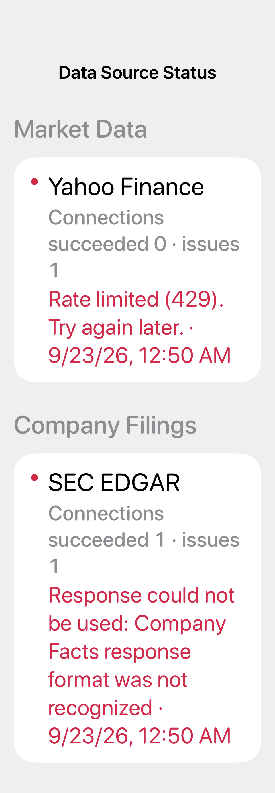
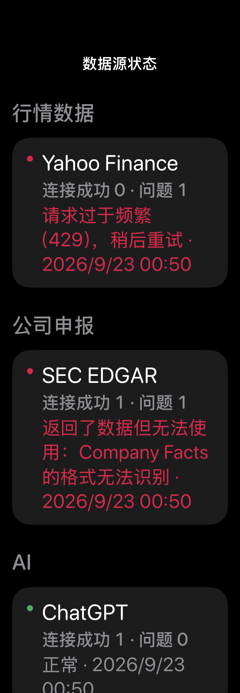

# iOS 数据源失败诊断（2026-09-23）

此前网络请求散落在多个客户端中：连接失败、HTTP 拒绝和返回内容无法解析时，部分页面只显示空数据或切到备用来源，读者很难判断原因。现在这些请求统一经过 `URLSession` 的记录包装；设置 → 本机数据 → 数据源状态按来源显示最近结果、连接成功次数和问题次数。SEC、FMP、Nasdaq 及新闻、行情、AI 等解析路径会额外记录“连接成功但数据无法使用”的情况。证券标志图片缺失属于可选展示资源，不纳入数据源故障统计。

诊断记录只保存在本次运行的内存中，保存来源、结果和时间；不保存完整网址、查询参数、密钥、证券代码或响应内容。取消的请求不算失败。历史记录限制为每个来源最近 12 条问题、最多 100 个来源。

验证：`DataSourceHealthTests` 和 `CompanyFinancialsSECTests` 共 8 项通过；`DataSourceStatusViewTests` 在 320 pt 宽、英中双语及大字/深色状态下通过，截图如下。`scripts/check_ios_localizations.py` 和 `git diff --check` 通过。

