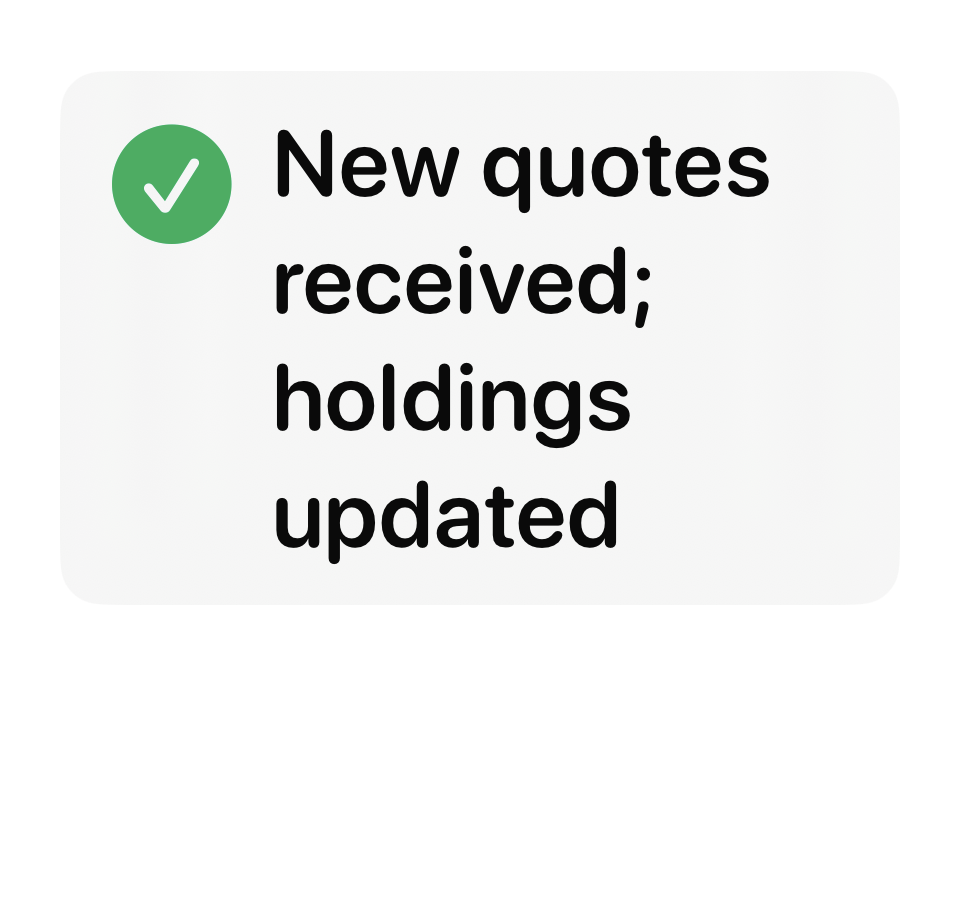
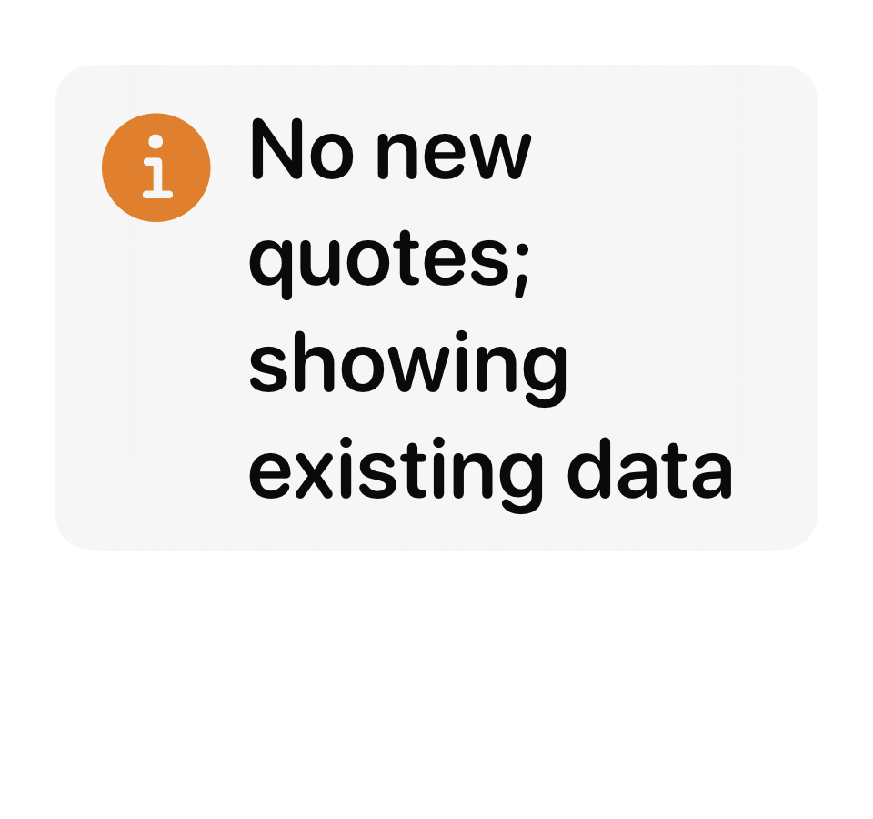
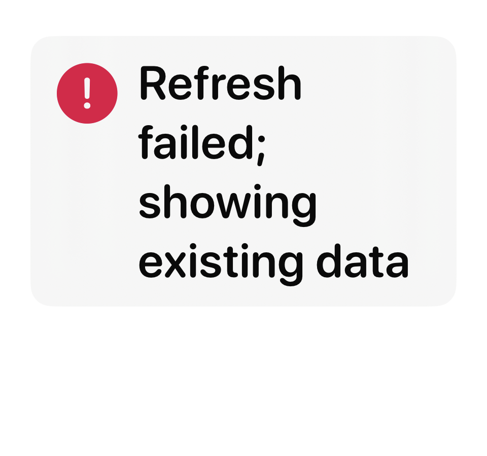

# iOS 首页刷新结果（2026-09-23）

首页下拉刷新和空态“重试”现在会显示一次明确的结果：取得新报价、只载入了持仓但没有新报价、没有新内容、空持仓，或刷新失败而继续显示已有数据。仅真正写入了更晚报价时间的行情才会显示“新报价”；恢复本地缓存不会冒充网络更新。后台自动载入不弹提示。提示在 6 秒后消失，并向 VoiceOver 播报。

320pt 宽、辅助功能大字号下的三种典型结果已截图复核，文字完整显示。`PortfolioRefreshResultTests` 3 项逻辑测试和 `PortfolioRefreshNoticeTests` 1 项视图测试通过。

| 新报价 | 无新报价 | 刷新失败、沿用已有数据 |
| --- | --- | --- |
|  |  |  |
